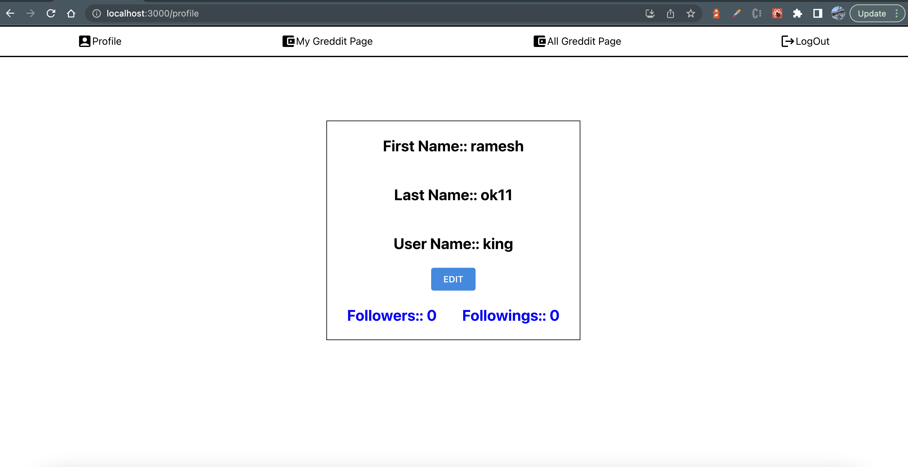
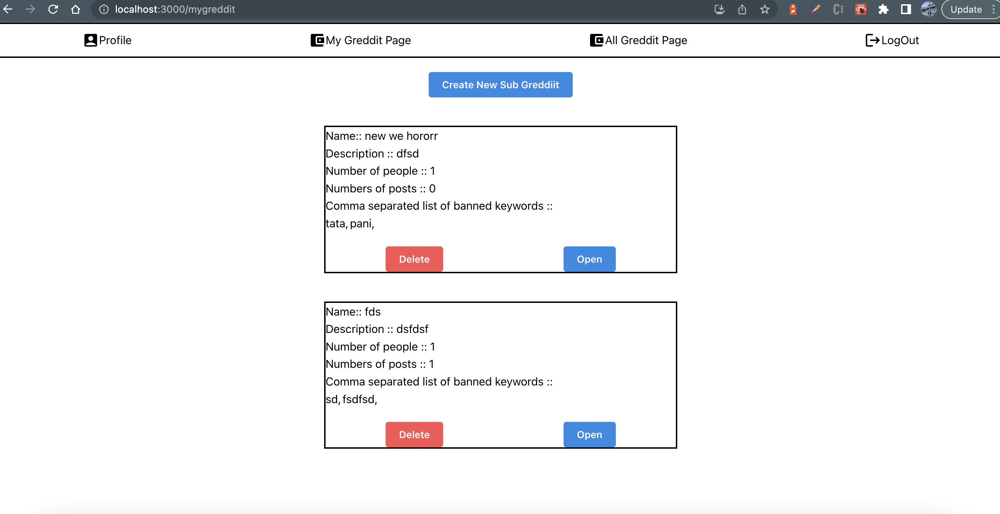
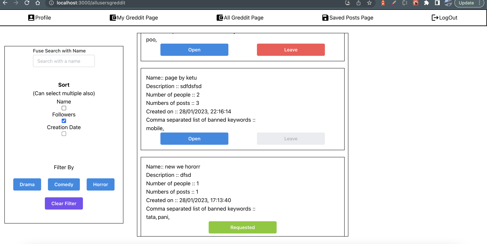
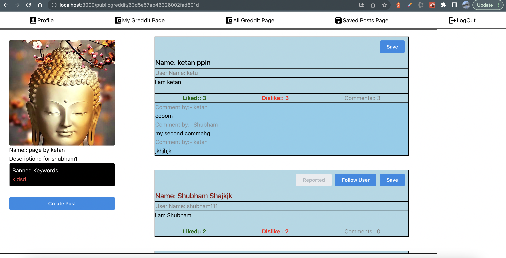

### Problem Statement:: 

<table>
  <tr>
    <td>
To build software using MERN stack (MongoDB, ExpressJS, ReactJS, and Nodejs ) Technology. This software should have the capability of handling registration, login, creating the greddiits, analyzing the greddiits on various factors, navigating through all the other sub greddiit from other users, managing the posts, and a few other crucial features. 
    </td>
    
  </tr>
 </table>

## Motto
To build the software from scratch within three days and try to finish all major functionality without bugs. I learned a lot within these three days and feeling good for that.  

## Demo 
Link- 

## Used Tech Stacks

    &nbsp;&nbsp; 
    &nbsp;&nbsp;
    &nbsp;&nbsp;
    &nbsp;&nbsp;

** MongoDB **
** ExpressJS **
** ReactJS **
** Nodejs **
  

## Other Important Library 

** MantineUI **
** MuiIcons **
** axios **
** fuse **
** bcrypt **
    

## Approach
- Phase 1.

Initially i analysed the complete problem statement and figured out major functionality.
Once i finished, I created a New database in my MongoDB project. After that I got the credential of database and set up the Express.js environment in my local system. I have also created a github repository for that and created two separate folder for front and back end with the readmi file. 
I started working on my backend initially and created my design pattern on MVC methodology. In the first step, I created a user collection in my database and worked on authentication API for the registration and sign-in page. 

After finishing the authentication process in the Backend I have set up my react application for the front end and created UI for the same with the required checks.

- Phase 2.

In this phase i worked on the home route I created a nav bar with all required options and icons as asked. 
I have put there a user profile page, my greddiit page, all greddiits page, and a logout option.I have also created all required pages in the react and completed the routing. 

After that in the backend, I created a few APIs for editing the user details, fetching the followers, and following. To create a new greddiit, get previously created greddiit by logged-in users. I have also created a api to get the required greddiit details for both user's own greddiit and other greddiits. 

- Phase 3.
In this phase I worked on all greddiits page. I created a lot of small components on this page I have written the Logic for Fuzzy search, filtering on the basis of tags and sorting on the basis of date, name and followers. 

I have also written the Logic to make a joining request on greddiit, to open the greddiits and to leave the greddiits those are previously joined.

- Phase 4.
In this phase I created the API for sub greddiit details page. I have created the API to post something, to like, to dislike and to comment. I have also created the API to follow the user and save the post. After finishing this much backend work i again shifted to the front end to start working on UI and integrating the APIs. I created a post model using maintine UI. In the post section, I have also taken care of banned words and used mantine notification system for making alerts.

- Phase 5.
In this Phase, I worked on states API and report API. In the Backend, I created the schema for States as well as Reports and created the basic CRUD operations on them. 
After finishing those API I tested them on postman and integrated on front end only required pages. 

- Phase 6. 
In the last phase of the project i did testing for app at multiple steps, I also worked on the basic checks and put a loader at a few places where API was sending bigger data. 
I also updated the readme file, I took the snapshots, and created a video for the explanation to better understanding.

## Few SnapShots
1. Phase 1 (0%)

2. Phase 2 (40%)

3. Phase 3 (80%)

4. Phase 4 (100%)

## Conclusion
Initially project was looking challenging in a very short span of time but without thinking much on the result side i started working on this with my maximum effort.
I tried to take care of each and every point of the problem statement and Implemented **a Greddiit app using MERN**. 

